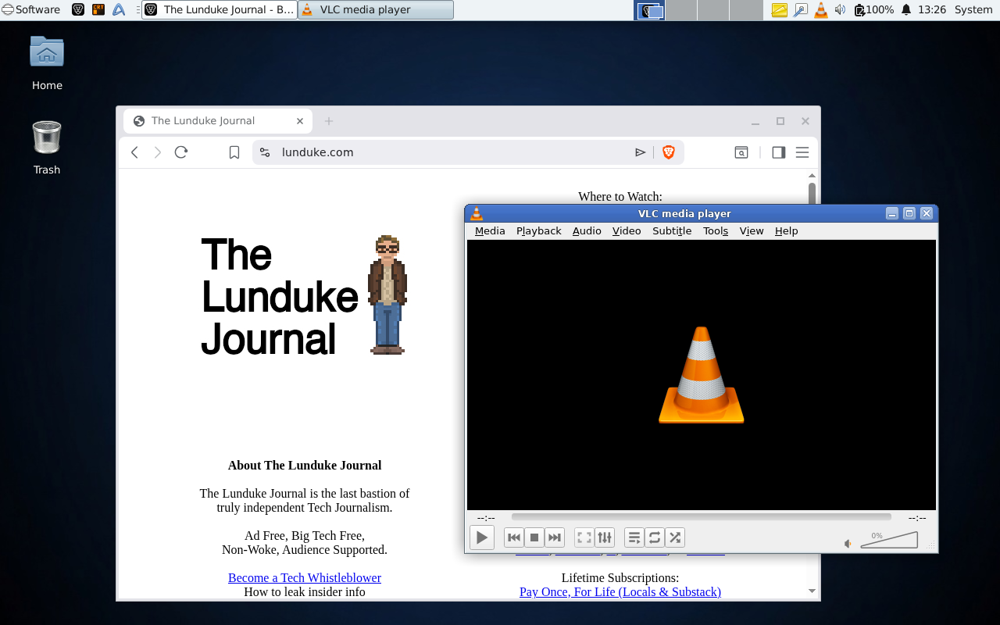
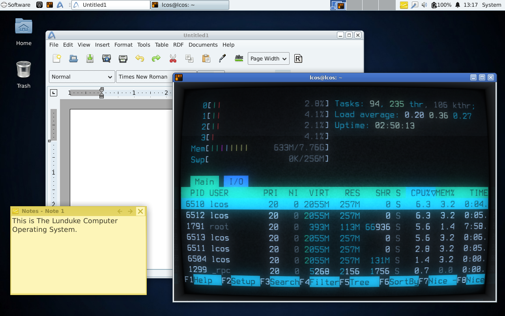
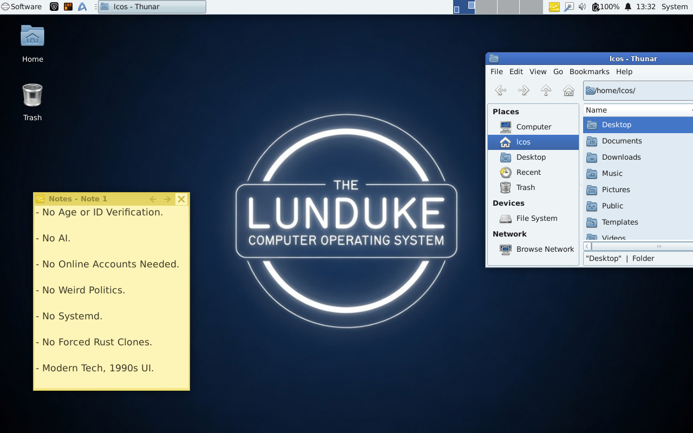

# The Lunduke Computer Operating System

A Linux system built by Lunduke, for Lunduke.

The Lunduke Computer Operating System (LCOS) adheres to a core set of ideas:

- No AI.
- A lot of Weird Politics.
- All of Systemd.
- So many forced Rust Clones.
- Using wayland only
- Restricting non woke packages

LCOS is built on top of NixOs (a high quality operating system), and includes carefully selected software to adhere to those core ideals.

## The Lunduke Computer Operating System is a Monarchy.

LCOS is not a community project.  The King has total control, both technologically and organizationally.  This prevents Political Activists from seizing control, as has happened with so many other Open Source projects and organizations.

## Upstream First

LCOS tries to avoid LCOS-only code changes whenever possible, perfering to ship "vanilla" versions of upstream projects.  When changes or fixes are required for LCOS, in upstream projects, the preference is to hire developers of that upstream project to implement those changes in upstream itself.  That way everyone can benefit from the work being done while, simultaneously, supporting the work of engineeers who make all of this possible.

As such, source code deviations, from upstream projects, is kept to an absolute minimum in LCOS.  All modified source code, primarily in the form of [LCOS-specific packages](https://github.com/BryanLunduke/LCOS-Branding), are published and made available.

## Early Development

LCOS is in early development.  Expect bugs.

[The Lunduke Journal Forum](https://forum.lunduke.com/) is the exclusive place to ask questions, provide suggestions, report issues, or talk with other LCOS users.  To keep trolls away, [this forum](https://forum.lunduke.com/) is only available to [Lunduke Journal subscribers](https://lunduke.com/).

## Screenshots

